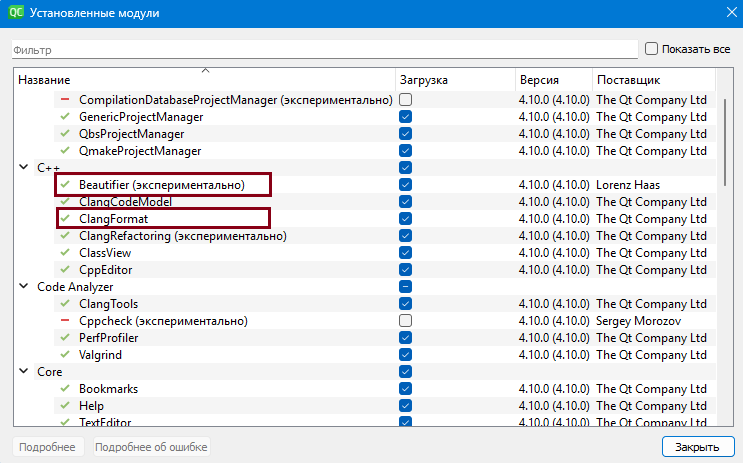
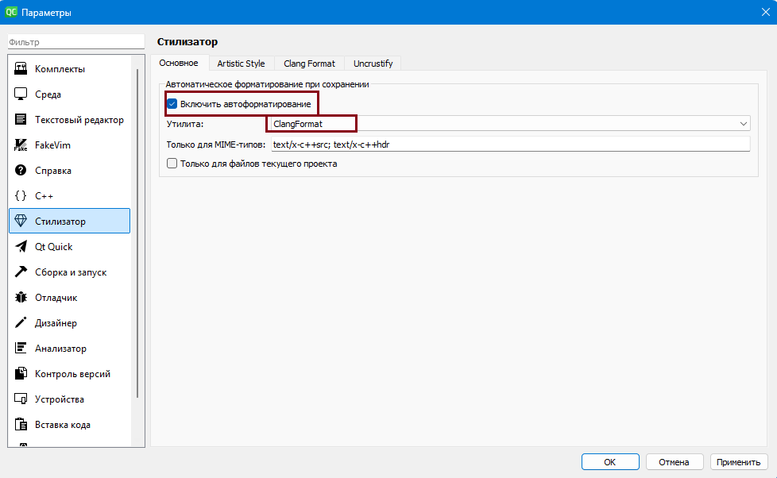
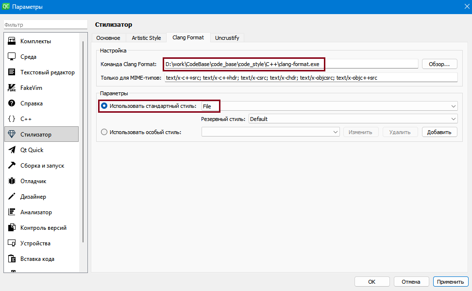

# Правила и утилиты для автоформатирования кода С++ в проектах CodeBase

## 💅 Настройка и установка ClangFormat в QtCreator

1. Включить необходимые модули(Beautifier и ClangFormat),  
   зайти в "Справка" -> "О модулях" - см. рис. 1.

   

   *Рисунок 1 - включение модулей.*

2. Появится модуль "Стилизатор", выберите необходимые  
   параметры (Включить автоформатирование ClangFormat,  
   выбрать путь к clang-format.exe и file со стилем кода), см. рис. 2, рис. 3.  
   Файл(.clang-format) со стилем кода  не нужно копировать в каждый проект,  
   clang-format.exe  находит его автоматически в корневой директории кодовой базы  
   (один экземпляр .clang-format используется для всех проектов).

   

   *Рисунок 2 - включение автоформатирования ClangFormat.*

   

   *Рисунок 3 - установка автоформатирования ClangFormat.*

4. Для автоформатирования кода при сохранении файла нужно   
   включить переопределение файла ClangFormat, см. рис. 4  
   и определить комбинацию горячих клавиш для команды FormatFile, см. рис.5.  

   

   *Рисунок 4 - выбор стиля кода ClangFormat.*

   

   *Рисунок 5 - использование ClangFormat по комбинации горячих клавиш.*

